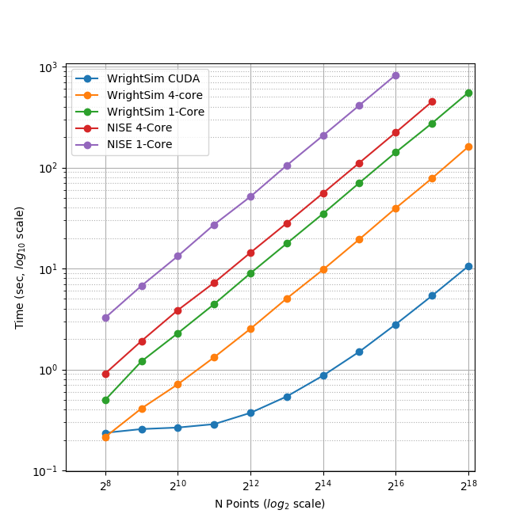

.. multiprocessing_

Multiprocessing in WrightSim
============================

WrightSim provides three different levels of computation:

- Single Core CPU: Run single threaded
- Multi Core CPU: Use multiprocessing_ to run on as many cores as the CPU has available.
- CUDA GPU: Use PyCUDA_ to run a highly parallel implementation.

.. caution:: Windows Users

   Using multiprocessing_ on Windows requires using ``if __name__ == "__main__":``
   to prevent infinite processes from being spawned. This does not apply to unix-styled systems.

   Additionally, the CUDA multiprocessing has not been tested under Windows.

Scaling Analysis
----------------

Both NISE_ and WrightSim scale linearly with respect to the number of points.
There is a 4x speed up when running on 4 CPU cores.
The CUDA implementation is 10x faster than 4 CPU cores, though it incurs a constant 200 millisecond offset for compilation.

.. _multiprocessing: https://docs.python.org/3/library/multiprocessing.html
.. _PyCUDA: https://documen.tician.de/pycuda/
.. _NISE: https://github.com/wright-group/NISE
